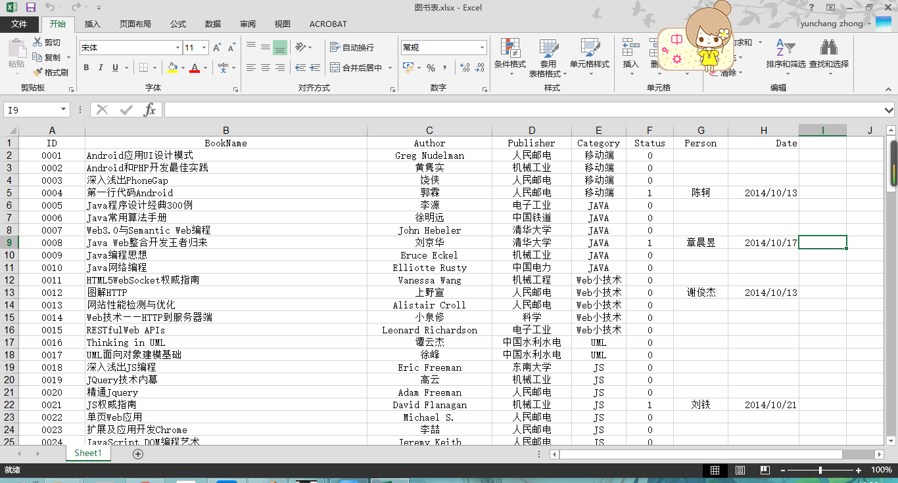
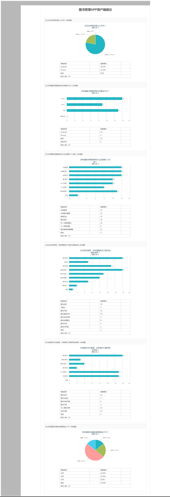

图书管理系统需求分析
====================
------------------------
###目前图书管理方式：如下图，手动修改，通过图书id来手动控制图书借阅与归还

- 缺点：
 - 手动借阅效率较低，增大了图书管理员的管理难度
 - 用户不能实现实时借阅，借阅不方便
 - 用户无法通过网络即时获得书库所有书的详细资料，图书借阅目的性较差
 - 用户不能实时获得自己的借阅历史和当前借阅记录
 
###调查问卷
- 调查人数：15人 

###同类软件：杭电图书馆管理系统
[http://www.lib.hdu.edu.cn/](http://www.lib.hdu.edu.cn/)

[http://www.bc863.com/rtts/2014-07/01/NewsView-46.html](http://www.bc863.com/rtts/2014-07/01/NewsView-46.html)
###图书管理的主要内容（会议讨论内容）
- 会议人员：钟云昶，白琳~，陈轲
-  图书管理员查看已购买的图书清单，执行入库操作后，可借阅。
 -  **补充：图书管理员查看已购买的图书清单，开始执行录入图书操作，把图书信息录入之后，管理员的APP可以手动批量生成相应的二维码（要求可以保存为图片到手机存储，以便于之后打印），此时此书并不可以借阅（可以设计成此书的信息只显示在图书管理员的图书表里，而对于借阅人此书的信息可以弹出提示“此书正在录入，暂时不可借阅，或者此书的信息对借阅人不可见）只有在管理员打印完二维码，贴到书上，并把图书放到书橱，会在APP上执行一个确认入库的操作，此时此书的录入工作完毕**
- 图书管理员查看未编码的入库图书清单，可单个或批量生成二维码(QRcode)，并输出打印
 - **补充：未录入的图书信息会有单独的模块，来方便图书管理员执行图书的录入操作**
 
- 借阅人借阅时，使用自己手机上的客户端，对目标图书的二维码进行扫描，返回成功提示后，即可将图书借出。
- 借阅人归还时，由管理员用自己手机上的客户端，对目标图书的二维码进行扫描，返回成功提示后，即为图书还入
- 借阅人可查看自己的当前借阅记录与历史统计信息**（借阅时间，借阅图书名称）**
- 管理员可查看图书的借阅等各类统计信息**（借阅时间，图书名称，借阅人姓名）**
 - **补充：在图书被借出时间超过20或者30天后，管理员APP会显示借阅时间超过20天的清单，借阅人APP端会自动显示借阅超过20或者30天提醒，以便于催促借书人归还图书）**

###预算:
**期限预算**
- 模块：注册，登陆，借阅，归还，显示书单，借阅历史，扫码，生成二维码，录入书籍，后台数据库
- 两人一个月完成10个模块的开发工作

**开发预算**
（看着给吧）
- 服务器费用：
- 客户经理：
- 项目经理：
- 技术经理：
- 开发人员*2：
